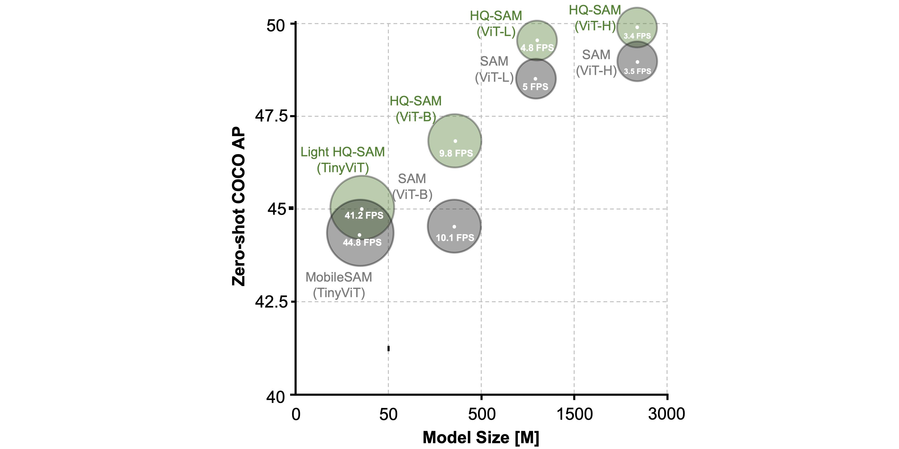

# Fine Tune SAM-HQ for Seagrass Segmentation

Fine tune Segment Anything in High Quality for UAV seagrass images.

Introduction
-----------------
The recent Segment Anything Model (SAM) represents a big leap in scaling up segmentation models, allowing for powerful zero-shot capabilities and flexible prompting. Despite being trained with 1.1 billion masks, SAM's mask prediction quality falls short in many cases, particularly when dealing with objects that have intricate structures. We propose HQ-SAM, equipping SAM with the ability to accurately segment any object, while maintaining SAM's original promptable design, efficiency, and zero-shot generalizability. SAM-HQ is a variant of SAM that reuses and preserves the pre-trained model weights of SAM, while only introducing minimal additional parameters and computation. SAM-HQ first uses the early and final ViT features for improving mask decoders. 


Quantitative comparison between SAM and HQ-SAM
-----------------
Note: For box-prompting-based evaluation, we feed SAM, MobileSAM and our HQ-SAM with the same image/video bounding boxes and adopt the single mask output mode of SAM. 

We provide comprehensive performance, model size and speed comparison on SAM variants:


### DAVIS
Note: Using ViT-L backbone. We adopt the SOTA model XMem as our video boxes prompt generator while reusing its object association prediction.


### **Quick Installation via pip**
```
pip install segment-anything-hq
python
from segment_anything_hq import sam_model_registry
model_type = "<model_type>" #"vit_l/vit_b/vit_h/vit_tiny"
sam_checkpoint = "<path/to/checkpoint>"
sam = sam_model_registry[model_type](checkpoint=sam_checkpoint)
```

see specific usage example (such as vit-l) by running belowing command:
```
export PYTHONPATH=$(pwd)
python demo/demo_hqsam_pip_example.py
```


### **Standard Installation**
The code requires `python>=3.8`, as well as `pytorch>=1.7` and `torchvision>=0.8`. Please follow the instructions [here](https://pytorch.org/get-started/locally/) to install both PyTorch and TorchVision dependencies. Installing both PyTorch and TorchVision with CUDA support is strongly recommended.

Clone the repository locally and install with

```
git clone https://github.com/siyuan668/seagrass-hq-sam.git
cd sam-hq; pip install -e .
```

The following optional dependencies are necessary for mask post-processing, saving masks in COCO format, the example notebooks, and exporting the model in ONNX format. `jupyter` is also required to run the example notebooks.

```
pip install opencv-python pycocotools matplotlib onnxruntime onnx timm
```

### Example conda environment setup
```bash
conda create --name sam_hq python=3.8 -y
conda activate sam_hq
conda install pytorch==1.10.0 torchvision==0.11.0 cudatoolkit=11.1 -c pytorch -c nvidia
pip install opencv-python pycocotools matplotlib onnxruntime onnx timm

# under your working directory
git clone https://github.com/SysCV/sam-hq.git
cd sam-hq
pip install -e .
export PYTHONPATH=$(pwd)
```

### **Model Checkpoints**

Three HQ-SAM model versions of the model are available with different backbone sizes. These models can be instantiated by running

```
from segment_anything import sam_model_registry
sam = sam_model_registry["<model_type>"](checkpoint="<path/to/checkpoint>")
```

Download the provided trained model below and put them into the pretrained_checkpoint folder:
```
mkdir pretrained_checkpoint
``` 

Click the links below to download the checkpoint for the corresponding model type. We also provide **alternative model downloading links** [here](https://github.com/SysCV/sam-hq/issues/5) or at [hugging face](https://huggingface.co/lkeab/hq-sam/tree/main).
- `vit_b`: [ViT-B HQ-SAM model.](https://drive.google.com/file/d/11yExZLOve38kRZPfRx_MRxfIAKmfMY47/view?usp=sharing)
- `vit_l`: [ViT-L HQ-SAM model.](https://drive.google.com/file/d/1Uk17tDKX1YAKas5knI4y9ZJCo0lRVL0G/view?usp=sharing)
- `vit_h`: [ViT-H HQ-SAM model.](https://drive.google.com/file/d/1qobFYrI4eyIANfBSmYcGuWRaSIXfMOQ8/view?usp=sharing)
- `vit_tiny` (**Light HQ-SAM** for real-time need): [ViT-Tiny HQ-SAM model.](https://huggingface.co/lkeab/hq-sam/resolve/main/sam_hq_vit_tiny.pth)

### **Getting Started**

First download a [model checkpoint](#model-checkpoints). Then the model can be used in just a few lines to get masks from a given prompt:

```
from segment_anything import SamPredictor, sam_model_registry
sam = sam_model_registry["<model_type>"](checkpoint="<path/to/checkpoint>")
predictor = SamPredictor(sam)
predictor.set_image(<your_image>)
masks, _, _ = predictor.predict(<input_prompts>)
```

To obtain HQ-SAM's visual result:
```
python demo/demo_hqsam.py
```

To obtain baseline SAM's visual result. Note that you need to download original SAM checkpoint from [baseline-SAM-L model](https://dl.fbaipublicfiles.com/segment_anything/sam_vit_l_0b3195.pth) and put it into the pretrained_checkpoint folder.
```
python demo/demo_sam.py
```

To obtain Light HQ-SAM's visual result:
```
python demo/demo_hqsam_light.py
```

### **HQ-SAM Tuning and HQ-Seg44k Data**
We provide detailed training, evaluation, visualization and data downloading instructions in [HQ-SAM training](train/README.md). You can also replace our training data to obtain your own SAM in specific application domain (like medical, OCR and remote sensing).

Please change the current folder path to:
```
cd train
```
and then refer to detailed [readme instruction](train/README.md).

### **Grounded HQ-SAM vs Grounded SAM on [SegInW](https://eval.ai/web/challenges/challenge-page/1931/overview?ref=blog.roboflow.com)**

Grounded HQ-SAM wins the **first place**:1st_place_medal: on SegInW benchmark (consist of 25 public zero-shot in the wild segmentation datasets), and outpuerforming Grounded SAM using the same grounding-dino detector.

<table><tbody>
<!-- START TABLE -->
<!-- TABLE HEADER -->
<th valign="bottom">Model Name</th>
<th valign="bottom">Encoder</th>
<th valign="bottom">GroundingDINO</th>
<th valign="bottom">Mean AP</th>
<th valign="bottom">Evaluation Script</th>
<th valign="bottom">Log</th>
<th valign="bottom">Output Json</th>
<!-- TABLE BODY -->
<!-- ROW: maskformer2_R50_bs16_50ep -->
 <tr><td align="left">Grounded SAM</td>
<td align="center">vit-h</td>
<td align="center">swin-b</td>
<td align="center">48.7</td>
<td align="center"><a href="seginw/test_seginw.sh">script</a></td>
<td align="center"><a href="seginw/logs/grounded_sam.log">log</a></td>
<td align="center"><a href="https://huggingface.co/sam-hq-team/SegInW/resolve/main/result/grounded_sam.zip">result</a></td>
</tr>
<!-- ROW: maskformer2_R101_bs16_50ep -->
 <tr><td align="left">Grounded HQ-SAM</td>
<td align="center">vit-h</td>
<td align="center">swin-b</td>
<td align="center"><b>49.6</b></td>
<td align="center"><a href="seginw/test_seginw_hq.sh">script</a></td>
<td align="center"><a href="seginw/logs/grounded_hqsam.log">log</a></td>
<td align="center"><a href="https://huggingface.co/sam-hq-team/SegInW/resolve/main/result/grounded_hqsam.zip">result</a></td>
</tr>
</tbody></table>

Please change the current folder path to:
```
cd seginw
```

## Acknowledgments

- Segment Anything in High Quality: code-https://github.com/SysCV/sam-hq; paper-https://arxiv.org/abs/2306.01567           

- Thanks [SAM](https://github.com/facebookresearch/segment-anything), [Grounded SAM](https://github.com/IDEA-Research/Grounded-Segment-Anything) and [MobileSAM](https://github.com/ChaoningZhang/MobileSAM) for their public code and released models.
